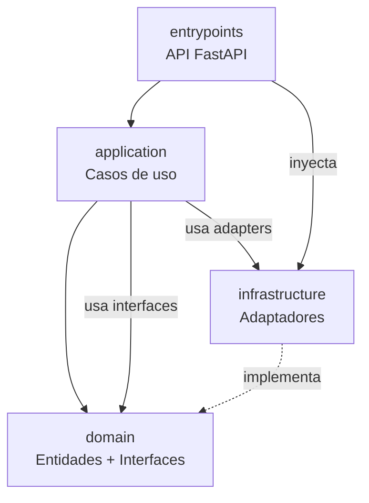
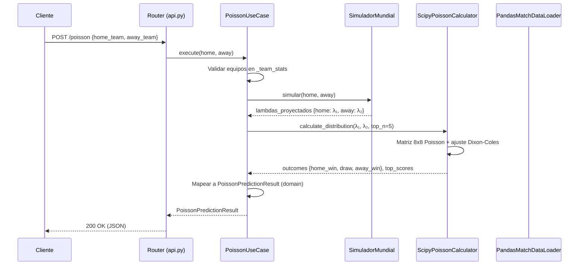
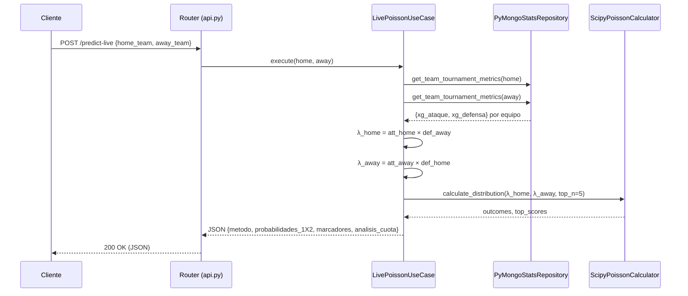
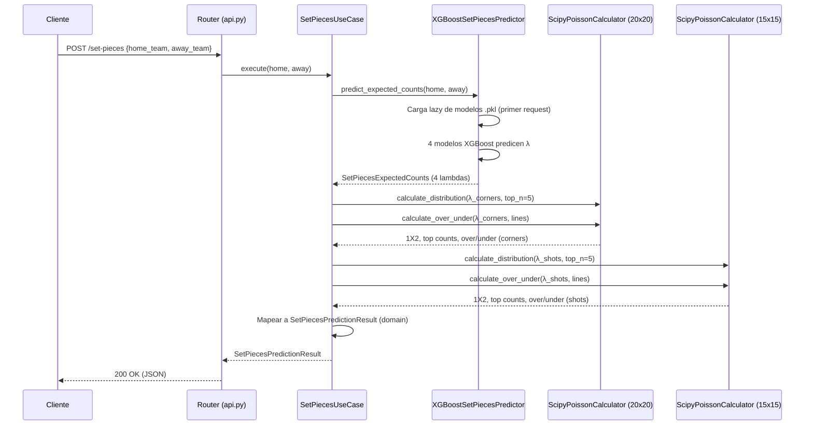
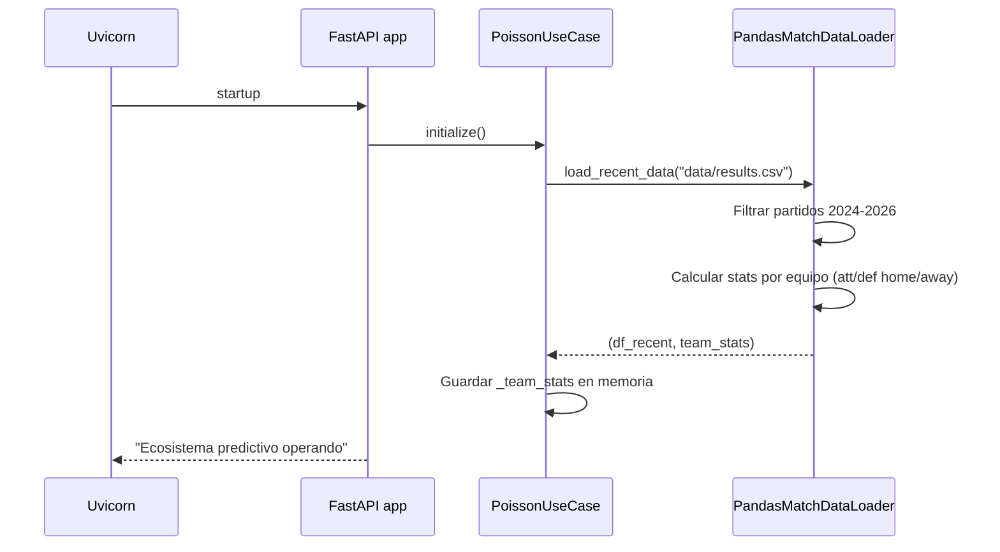

# Arquitectura

El proyecto sigue una **arquitectura hexagonal** (también conocida como *Ports & Adapters* o *Clean Architecture*), que separa el núcleo de negocio de los detalles técnicos mediante interfaces abstractas.

---

## Capas



| Capa | Directorio | Responsabilidad |
|------|-----------|----------------|
| **domain** | `src/domain/` | Núcleo puro: entidades (dataclasses) e interfaces abstractas (ABC). Sin dependencias externas. |
| **application** | `src/application/` | Casos de uso que orquestan la lógica de negocio. Consumen interfaces del domain, no implementaciones concretas. |
| **infrastructure** | `src/infrastructure/` | Adaptadores concretos: acceso a datos, cálculos estadísticos, modelos ML, repositorios. Implementan las interfaces del domain. |
| **entrypoints** | `src/entrypoints/` | Punto de entrada HTTP (FastAPI). Define routers, modelos de request (Pydantic) y realiza la inyección de dependencias. |

---

## Domain (`src/domain/`)

### `models.py` — Entidades

Dataclasses que representan los conceptos del dominio:

| Entidad | Campos | Uso |
|---------|--------|-----|
| `MatchTeams` | `home`, `away` | Par de equipos de un partido |
| `ExpectedGoals` | `home`, `away` | Goles esperados (lambdas λ) |
| `Probabilities1X2` | `home_win`, `draw`, `away_win` | Probabilidades 1X2 |
| `FairOdds` | `home_win`, `draw`, `away_win` | Cuotas justas (1/probabilidad) |
| `ExactScore` | `score`, `formatted_score`, `probability_percent` | Marcador exacto con su probabilidad |
| `PoissonPredictionResult` | teams, expected_goals, probabilities_1X2, fair_odds, top_exact_scores | Resultado completo de Poisson |
| `RandomForestPredictionResult` | equipo_1, equipo_2, doble_oportunidad, probabilidad_1, probabilidad_empate, probabilidad_2, mas_menos_goles, ambos_anotan, marcador_exacto | Resultado completo de Random Forest |

### `interfaces.py` — Puertos (ABC)

Define los contratos que la infraestructura debe implementar:

```python
class MatchDataLoader(ABC):
    def load_recent_data(self, file_path: str) -> Tuple[pd.DataFrame, Dict[str, Dict[str, float]]]: ...

class ProbabilityCalculator(ABC):
    def calculate_distribution(self, expected_goals: ExpectedGoals, top_n: int = 5) -> Tuple[Dict[str, float], List[Dict[str, float]]]: ...

class MatchStatsRepository(ABC):
    def get_team_historical_summary(self, team_name: str) -> Optional[Dict[str, Any]]: ...
```

---

## Application (`src/application/`)

Casos de uso que orquestan la lógica. Cada uno recibe sus dependencias por constructor (inyección):

| Caso de uso | Archivo | Dependencias inyectadas | Endpoint |
|-------------|---------|------------------------|----------|
| `RandomForestUseCase` | `random_forest_use_case.py` | `simulador_forest` | `POST /random-forest` |
| `PoissonUseCase` | `poisson_use_case.py` | `data_loader`, `prob_calculator`, `simulador_forest`, `data_path` | `POST /poisson` |
| `GetStatsUseCase` | `get_stats_use_case.py` | `repository` | `GET /match-stats` |
| `LivePoissonUseCase` | `live_poisson_use_case.py` | `mongo_repo`, `prob_calculator` | `POST /predict-live` |
| `SetPiecesUseCase` | `set_pieces_use_case.py` | `set_pieces_predictor`, `corners_calculator`, `shots_calculator` | `POST /set-pieces` |

---

## Infrastructure (`src/infrastructure/`)

Adaptadores concretos que implementan las interfaces del domain:

| Adaptador | Archivo | Interfaz que implementa |
|-----------|---------|------------------------|
| `PandasMatchDataLoader` | `data_loader.py` | `MatchDataLoader` |
| `ScipyPoissonCalculator` | `poisson_calculator.py` | `ProbabilityCalculator` |
| `PyMongoStatsRepository` | `mongo_repository.py` | `MatchStatsRepository` |
| `XGBoostSetPiecesPredictor` | `set_pieces_predictor.py` | `SetPiecesPredictor` |
| `SimuladorMundial` | `predictor.py` | — (clase concreta, consume modelos `.pkl`) |
| `TeamTranslator` | `team_translator.py` | — (utilidad de traducción de nombres) |

---

## Entrypoints (`src/entrypoints/`)

### `api.py` — Inyección de dependencias

El router único (`/api/v1`) instancia los adaptadores concretos y los inyecta en los casos de uso:

```python
# Adaptadores (infrastructure)
data_loader = PandasMatchDataLoader()
poisson_calculator = ScipyPoissonCalculator()
simulador_forest = SimuladorMundial()
mongo_repo = PyMongoStatsRepository()

# Casos de uso (application) con dependencias inyectadas
rf_use_case = RandomForestUseCase(simulador_forest=simulador_forest)
poisson_use_case = PoissonUseCase(
    data_loader=data_loader,
    prob_calculator=poisson_calculator,
    simulador_forest=simulador_forest,
    data_path=str(DATA_PATH),
    top_n=5
)
stats_use_case = GetStatsUseCase(repository=mongo_repo)
live_poisson_use_case = LivePoissonUseCase(mongo_repo=mongo_repo, prob_calculator=poisson_calculator)

set_pieces_predictor = XGBoostSetPiecesPredictor()
corners_calculator = ScipyPoissonCalculator(max_goals=20)
shots_calculator = ScipyPoissonCalculator(max_goals=15)
set_pieces_use_case = SetPiecesUseCase(
    set_pieces_predictor=set_pieces_predictor,
    corners_calculator=corners_calculator,
    shots_calculator=shots_calculator,
    top_n=5,
)
```

---

## Principios SOLID aplicados

| Principio | Aplicación |
|-----------|-----------|
| **S** (Single Responsibility) | `MatchDataLoader` solo carga datos; `ProbabilityCalculator` solo calcula distribuciones; `MatchStatsRepository` solo persiste/consulta. |
| **O** (Open/Closed) | El motor estadístico es intercambiable: cualquier clase que implemente `ProbabilityCalculator` puede sustituir a `ScipyPoissonCalculator` sin tocar los casos de uso. |
| **L** (Liskov) | Los adaptadores respetan exactamente las firmas de las interfaces ABC. |
| **I** (Interface Segregation) | Interfaces granulares: carga de datos, cálculo de probabilidades y repositorio son contratos separados. |
| **D** (Dependency Inversion) | Los casos de uso dependen de abstracciones (`MatchDataLoader`, `ProbabilityCalculator`, `MatchStatsRepository`), no de implementaciones concretas. La inyección se realiza en `entrypoints/api.py`. |

---

## Flujo de datos: `POST /api/v1/poisson`



### El Puente de Conexión Absoluta (RF → Poisson)

El diseño clave del sistema es que **Poisson no calcula los goles esperados por sí solo**: consume los lambdas (λ) proyectados por el Random Forest.

1. `PoissonUseCase.execute()` llama a `SimuladorMundial.simular()` (`predictor.py:19`).
2. El Random Forest usa dos regresores (`modelo_regresor_A.pkl` y `modelo_regresor_B.pkl`) para predecir los goles esperados de local y visitante.
3. Estos lambdas se devuelven en `rf_output["lambdas_proyectados"]`.
4. `PoissonUseCase` los envuelve en `ExpectedGoals` y los pasa al `ScipyPoissonCalculator`.
5. El calculador construye la matriz Poisson 8x8 con ajuste Dixon-Coles y devuelve probabilidades 1X2 + top marcadores.

Esto significa que el motor Poisson se alimenta de la fuerza predictiva del Random Forest, unificando ambos enfoques.

---

## Flujo de datos: `POST /api/v1/predict-live`



A diferencia de `/poisson`, este flujo **no usa el Random Forest**: los lambdas provienen de métricas xG reales del torneo almacenadas en MongoDB. Si un equipo no tiene registros, usa valores fallback (1.35 ataque / 1.10 defensa).

---

## Flujo de datos: `POST /api/v1/set-pieces`



Este flujo combina **XGBoost** (predicción de lambdas) con **Dixon-Coles** (distribución probabilística). Usa dos instancias de `ScipyPoissonCalculator` con matrices de diferente tamaño: 20×20 para corners y 15×15 para tiros a puerta. Los modelos XGBoost se cargan de forma **lazy** al primer request, no al iniciar la API.

---

## Ciclo de vida



Al arrancar la API, `PoissonUseCase.initialize()` pre-carga en memoria el diccionario de estadísticas de equipos desde `results.csv` (ventana 2024-2026). Esto evita re-leer el CSV en cada request a `/poisson`.
